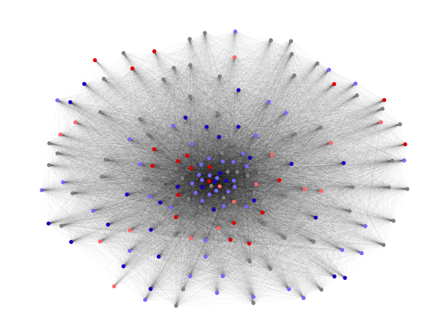
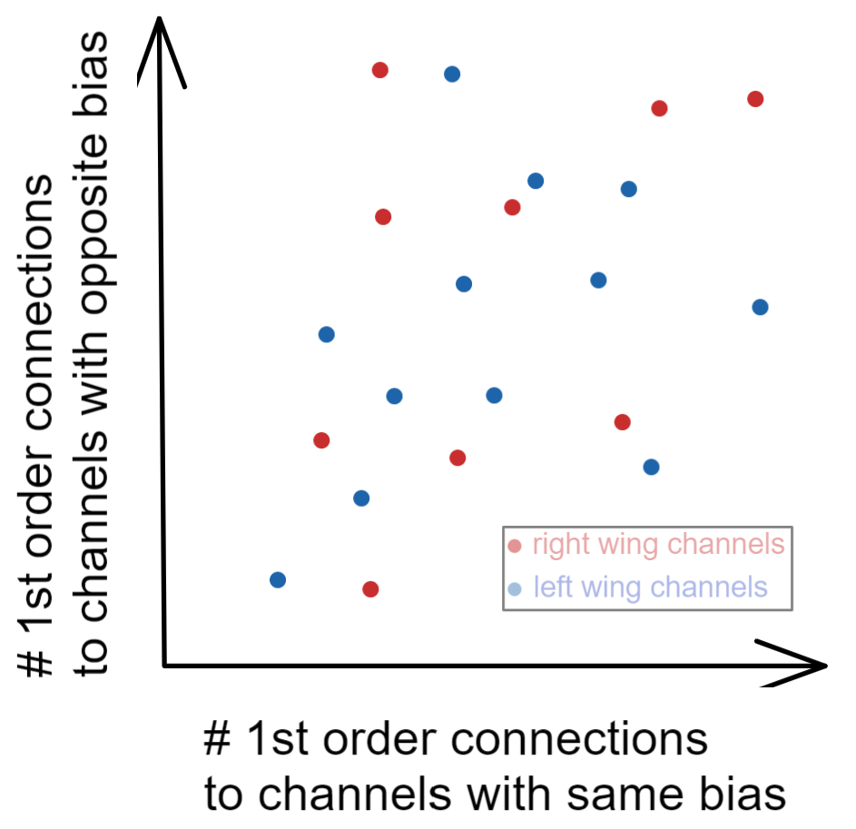
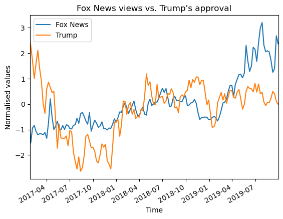
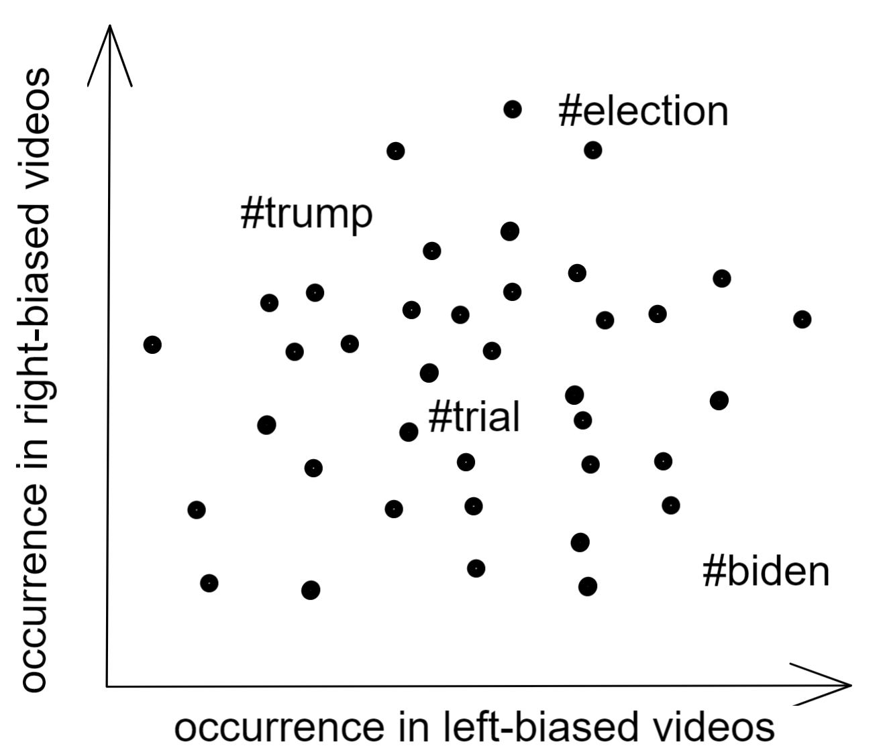

# Can data unite people, reverse political polarisation and heal America? 
a Data Story based on the YouNiverse dataset

## Background ​​⌛️
Can we identify topics that unite polarised Americans, in the hope of minimising their division? We keep hearing how the political discourse is polarised nowadays in the United States (and perhaps the rest of the anglosphere) [1]. It seems that the left and right can't agree on anything. Culprits cited for this polarisation amongst others are cable news [4] (as opposed to what is commonly thought is social media [3]). With YouNiverse, we have access to the youtube counterpart of these news channels (along with many other smaller channels) and can explore indirectly the behaviour of political viewers. 

One aspect that is theorised to cause polarisation, is that the political information people consume is increasingly polar (biased towards one side or the other) [4]. Organisations such as AllSides are doing work to tag news channels according to the “pole” (political faction i.e. left, right) they are biased towards [5]. Using YouNiverse/youtube data as a proxy for the political preference of people (by assuming it correlates with the political news channel preference) we want to see if polarisation is true on youtube as well, whether the political channels popularity could correlate with popularity in the real world of politics (which could raise the question about a causal relationship as well) and whether there are any topics of unity that we assume could be talked about to bring unity instead.

\[1\]: https://www.ncbi.nlm.nih.gov/pmc/articles/PMC7201237/

\[2\]: https://arxiv.org/pdf/1908.08313.pdf

\[3\]: https://www.pnas.org/doi/10.1073/pnas.2101967118#con1

\[4\]: Cable networks more polarized

\[5\]: https://www.allsides.com/media-bias

## Research Questions❓
To what extent is YouTube politically polarised?
How do political YouTube channels play a role in this polarisation?
Are there any topics that unite polarised youtubers?

## Additional Datasets
AllSides Media Bias Rating (https://www.allsides.com/media-bias/ratings) rates major American news outlets’ political bias.
FiveThirtyEight polling data: Trump’s approval rating (https://projects.fivethirtyeight.com/trump-approval-ratings/)

## Methods (by question) 🧰 🪡
### 1. To what extent is YouTube politically polarised?
How divided are the user groups between the left or right wing channels? To obtain a holistic intuition of how the investigated channels are clustered, we will create a network graph with channels as nodes (coloured by political bias) and edge weights between nodes that are proportional to the number of shared commenters. In this way, we hope to visualise the ‘bubbles’ of channels with common political views and how they are connected.

1a: The basis of our discussions is a mapping of left- and right-leaning news outlets to their YouTube channels. We use a dataset from AllSides (Additional Dataset 1) that classifies news outlets into left- and right-leaning.

1b: We create a graph of channels connected by users that comment on videos of both channels. This nicely visualises the connection between them and especially lends itself to see how left- and right-leaning channels are clustered. Using graph-theoretical centrality measurements (betweenness centrality, clustering, …) to identify particularly connected and isolated nodes on either side.

1c: By determining, for each channel, the sum of user connections between itself and another channel with a) the same political bias (on the x-axis) and b) the opposite political bias (on the y-axis) we can visualise the extent to which the political bias filter bubbles are divided.
Example visualisation:

1d: To map the political leanings of users we use the videos they commented under. We score each user by summing up the political leaning of each video using the following scores 1: left, 0.5: left-leaning, 0: centre, -0.5: right-leaning, -1: right. Seeing a normal distribution would indicate a moderate overall behaviour and the absence of filter bubbles. Or would there be two “bumps”?

### 2. How do political YouTube channels play a role in this polarisation?
Do certain news media metrics correlate with political poll results (e.g. approval ratings, election results, …)? We’re trying to see whether there exists correlations through time.

2a: By using the time series dataset we compare channels’ view counts with approval data of Donald Trump during his time in office (Additional dataset 2). We group the dataset based on whether a channel has political bias towards right or left. We plotted the weekly viewing evolution during the time period. In our sample visualisation we focus on just Fox News. We would like to analyse specific moments of noticeable correlation, whether these moments relate to an important event, a statement by a politician or a influenceable person.

2b: Do negative or favourable coverage of Trump coincide with his popularity ratings? We run a roberta based sentiment analysis model on video titles (See 4b). For left and right-leaning media we aggregate video favorability weighted by the video’s view count for each week. This data, we overlay with sentiment data.

2c: By visualising the pure effect of video title sentiment (See 4b) on view count for videos posted by both left- and right-biased channels, we can gain further insight into the connection between relevant events/topics and what YouTube recommends to users. We can do this by propensity score matching using features such as video duration, channel subscribers where the “treated groups’’ would be videos with positive sentiment (or negative sentiment) and “control groups” would be videos with neutral or negative sentiment. We would then sum the video views for each case.
Example visualisation:

### 3. Are there any topics that unite polarised youtubers? 🧶
Investigating video’s tags will give us an indication if certain videos’ topics are more popular on either political side or if they are represented equally.
For the subset of videos of news outlets we extract all tags and count the number of occurrences on left- or right-leaning videos.
To visualise we imagine the following diagram showing some of most popular tags:

## Organisation of work

Method 1-3 outlined above

4 Miscellaneous data work
4a Manual Data cleaning
4b Sentiment analysis pipeline using a pre-trained model (https://huggingface.co/cardiffnlp/twitter-roberta-base-sentiment)

5 Data Story
5a technical setup/pipeline
5b compilation and texts

| Work Package | People                       |
|--------------|------------------------------|
| 1a           | Marc                         |
| 1b           | Marc                         |
| 1c           | Angelo                       |
| 1d           | Andrei                       |
| 2a           | Juhani                       |
| 2b           | Juhani                       |
| 2c           | Angelo                       |
| 3            | Andrei                       |
| 4a           | Marc                         |
| 4b           | Juhani                       |
| 5a           | Marc, Angelo                 |
| 5b           | Andrei, Juhani, Marc, Angelo |

## Timeline 📈
Internal deadlines
25/11/22: 4a, 4b

02/12/22: Homework 2 Due, no project deadlines

09/12/22: 1a, 1b, 1c, 2a, 1d

16/12/22: 5a, 2b, 2c, 3

22/12/22: Compile results into data story > Final product